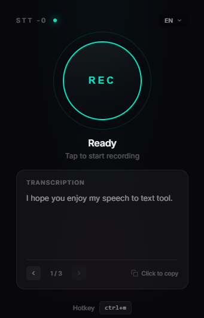

# Voice Agent

A desktop tool that converts speech to text using Groq's Whisper API. Press a hotkey, speak into your microphone, and the transcribed text is copied to your clipboard ready to paste anywhere.



Built for speed - transcriptions typically complete in under 2 seconds.

## Features

**Core**
- Global hotkey activation (`Ctrl+M` by default) - works from any application
- Fast transcription via Groq Whisper API (free tier available)
- Automatic clipboard copy - just paste where you need it

**UI**
- Minimal always-on-top window
- Visual recording/processing states
- Transcription history with navigation (stores last 20)
- Language dropdown with 5 languages (English, Italian, Spanish, French, German)
- Language preference saved automatically

**Extras**
- Filler word removal ("uhm", "ehm", etc.)
- Custom text corrections via config
- Punctuation support through smart prompting

## Setup

**Requirements**: Python 3.10+, microphone, Groq API key

```bash
git clone https://github.com/0xGval/speech-to-text-app.git
cd speech-to-text-app

python -m venv venv
venv\Scripts\activate  # Linux/Mac: source venv/bin/activate

pip install -r requirements.txt
```

Get a free API key from [console.groq.com](https://console.groq.com) and create a `.env` file:

```
GROQ_API_KEY=gsk_your_key_here
```

## Usage

```bash
python main.py
```

On Windows, double-click `run.vbs` after setup (no console window).

1. Press `Ctrl+M` to start recording
2. Speak into your microphone
3. Press `Ctrl+M` again to stop
4. Text is transcribed and copied to clipboard
5. Paste with `Ctrl+V`

Use the arrow buttons in the UI to browse through your previous transcriptions. Click the language dropdown to switch between languages - your preference is saved automatically.

## Configuration

All settings are in `config.yaml`:

```yaml
# Hotkey combination to toggle recording
hotkey: "ctrl+m"

# Transcription language (saved automatically when changed in UI)
language: "en"

# Patterns to remove or replace after transcription
text_corrections:
  - ["ehm", ""]
  - ["uhm", ""]
  - ["mhm", ""]

# Audio capture settings
audio:
  sample_rate: 16000
  channels: 1
```

## Dependencies

| Package | Purpose |
|---------|---------|
| `sounddevice`, `numpy`, `scipy` | Audio recording and WAV encoding |
| `groq` | Whisper API client |
| `keyboard` | Global hotkey listener |
| `pyperclip` | Clipboard operations |
| `pywebview` | Native window with embedded UI |
| `pyyaml` | Configuration file parsing |

## Project Structure

```
voice_agent/
├── main.py          # Entry point
├── config.py        # Configuration loading
├── config.yaml      # User settings
├── core/
│   ├── recorder.py      # Microphone capture
│   ├── transcriber.py   # Groq API integration
│   └── processor.py     # Text cleanup
└── ui/
    └── app.py           # PyWebView interface
```

## License

MIT
